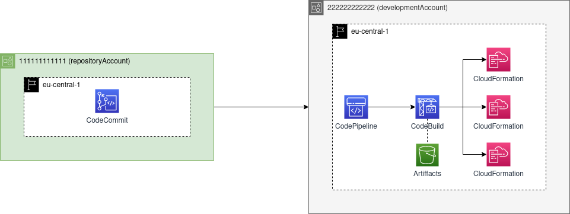

CDK Pipeline Construct fails in the cross-account configuration due to a lack of RoleArn property.



# Bootstrapping

**DEVELOPMENT ACCOUNT:**  
```cdk bootstrap aws://DEVELOPMENT_ACCOUNT_NUMBER/eu-central-1 --toolkit-stack-name BugReproduceCDKToolkit --qualifier bugreproduce```

**REPOSITORY ACCOUNT:**  
```cdk bootstrap REPOSITORY_ACCOUNT_NUMBER/eu-central-1 --cloudformation-execution-policies 'arn:aws:iam::REPOSITORY_ACCOUNT_NUMBER:policy/AdministratorAccess' --trust 'DEVELOPMENT_ACCOUNT_NUMBER' --trust-for-lookup 'DEVELOPMENT_ACCOUNT_NUMBER' --toolkit-stack-name BugReproduceCDKToolkit --qualifier bugreproduce```

> If you want to use other CDK Toolkit, remember to update bootstrapQualifier in the `cdk.json`


# Deployment
1. Assume role from the **development account**
2. npx cdk synth
3. npx cdk deploy --all

```RoleArn is required for target arn:aws:events:eu-central-1:DEVELOPMENT_ACCOUNT_NUMBER:event-bus/default. (Service: AmazonCloudWatchEvents; Status Code: 400; Error Code: ValidationException; Request ID: 564e1b69-13ea-4c53-b411-0b68bae707ac; Proxy: null)```


# Debugging
`npx cdk synth BugReproduce-Repository-dev > RepositoryTemplate`  
It creates AWS::Events::Rule resource without `RoleArn` in the `Targets`.